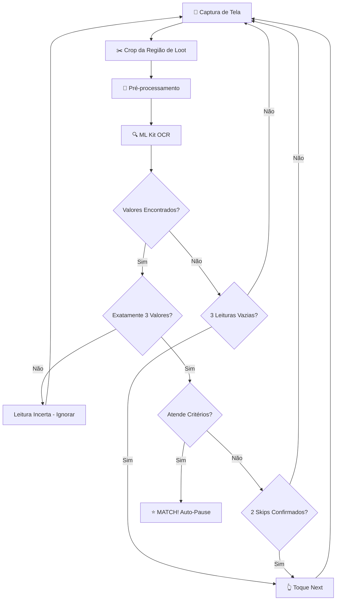

<p align="center">
  
</p>

<h1 align="center">⚔️ Clash Finder</h1>

<p align="center">
  <strong>Encontre automaticamente as melhores bases para atacar no Clash of Clans</strong>
</p>

<p align="center">
  
  
  
  
  
</p>

---

## 📖 Sobre

**Clash Finder** é um aplicativo Android que automatiza a busca por bases com loot alto no Clash of Clans. Usando captura de tela em tempo real e reconhecimento óptico de caracteres (OCR), o app analisa os valores de **Ouro**, **Elixir** e **Elixir Negro** de cada base e automaticamente pula as que não atendem aos seus critérios — parando apenas quando encontra uma base que vale a pena atacar.

---

## ✨ Funcionalidades

| Recurso | Descrição |
|---------|-----------|
| 🔍 **OCR Inteligente** | Reconhecimento de números via ML Kit com pré-processamento de imagem (inversão de cores + boost de contraste) |
| 🎯 **Detecção Precisa** | Sistema de confirmação com 2 leituras consecutivas antes de pular — evita falsos positivos |
| ⏳ **Espera de Animação** | Aguarda a animação do jogo terminar (3 leituras vazias) antes de tomar decisões |
| 🔒 **Match Lock** | Ao encontrar uma base boa, trava automaticamente e pausa os toques — nunca perde a base |
| ▶️ **Resume Inteligente** | Botão flutuante muda para "Resume" ao encontrar match; clique para continuar buscando |
| ⚙️ **Limiares Configuráveis** | Defina valores mínimos para Ouro/Elixir e Dark Elixir |
| 📊 **Contagens Mínimas** | Configure quantos recursos devem estar acima do limiar |
| 🧹 **Limpeza OCR** | Correção automática de caracteres confundidos (`O→0`, `S→5`, `l→1`, `B→8`, etc.) |
| 📱 **Overlay Flutuante** | Botão Pause/Resume sempre visível sobre o jogo |
| 💾 **Persistência** | Configurações salvas automaticamente entre sessões |

---

## 🔧 Como Funciona



### Pipeline de Processamento

1. **Captura** — Screenshot via `MediaProjection` a cada ~4 segundos
2. **Crop** — Recorta apenas a região dos valores de loot (canto superior)
3. **Pré-processamento** — Escala 2x + inversão de cores + boost de contraste (texto escuro em fundo claro = ideal para ML Kit)
4. **OCR** — ML Kit Text Recognition extrai os números
5. **Limpeza** — Substituição contextual de caracteres confundidos (só quando adjacente a dígitos)
6. **Validação** — Requer 2 leituras consecutivas com exatamente 3 valores antes de decidir
7. **Ação** — Skip (toque Next) ou Match (auto-pause)

---

## 📲 Instalação

### Pré-requisitos

- Android **9.0+** (SDK 28)
- Permissão de **Acessibilidade** (para toques automáticos)
- Permissão de **Captura de Tela** (MediaProjection)
- Permissão de **Overlay** (botão flutuante)

### Build

```bash
# 1. Clone o repositório
git clone https://github.com/seu-usuario/clash-finder.git
cd clash-finder

# 2. Abra no Android Studio e compile
# Ou via terminal:
./gradlew assembleDebug

# 3. Instale no dispositivo
adb install app/build/outputs/apk/debug/app-debug.apk
```

---

## 🚀 Como Usar

1. **Abra o Clash Finder** e configure os limiares:
   - **Ouro/Elixir mínimo** — valor mínimo para cada recurso (ex: `1000000`)
   - **Dark Elixir mínimo** — valor mínimo de elixir negro (ex: `4000`)
   - **Contagens** — quantos recursos devem estar acima do limiar

2. **Ative o Touch Service** nas configurações de acessibilidade do Android

3. **Clique em "Start"** — o app pedirá permissão de captura de tela

4. **Abra o Clash of Clans** e vá para a tela de busca de bases

5. O app automaticamente:
   - 🔍 Lê os valores de loot
   - ⏭️ Pula bases que não atendem os critérios
   - ⭐ Para quando encontra uma base boa
   - ⏸️ Mostra "Resume" no botão flutuante

6. **Clique "Resume"** quando quiser continuar buscando

---

## 🏗️ Arquitetura

```
com.debug.open_clans/
├── MainActivity.java          # Lógica principal: captura, OCR, decisão
│   ├── analyzeImage()         # Captura → crop → pré-processamento → ML Kit
│   ├── processOcrResult()     # Sistema de confirmação (match/skip/animation)
│   ├── extractNumbers()       # Parsing de números com limpeza OCR
│   ├── preprocessForOcr()     # Inversão de cores + contraste
│   └── cleanOcrText()         # Substituição de caracteres confundidos
│
├── TouchService.java          # Accessibility Service: toques + botão overlay
│   ├── performTap()           # Executa toque via GestureDescription
│   ├── showFloatingButton()   # Botão Pause/Resume sobre o jogo
│   └── matchReceiver          # Auto-pause quando MATCH encontrado
│
└── MyMediaProjectionService.java  # Foreground service para captura de tela
```

### Comunicação entre Componentes

| Broadcast | De → Para | Quando |
|-----------|-----------|--------|
| `PERFORM_TAP` | MainActivity → TouchService | Precisa tocar "Next" |
| `MATCH_FOUND` | MainActivity → TouchService | Base boa encontrada → auto-pause |
| `MATCH_RESUMED` | TouchService → MainActivity | Usuário clicou "Resume" → desbloquear |
| `CAPTURE_STARTED` | Service → TouchService | Mostrar botão flutuante |
| `CAPTURE_STOPPED` | Service → TouchService | Remover botão flutuante |

---

## 🛡️ Segurança e Ética

- O app **não modifica** o jogo de nenhuma forma
- Apenas **lê pixels da tela** e **simula toques** que o usuário faria manualmente
- Todas as permissões são **explicitamente solicitadas** ao usuário
- O código é **100% open source** — audite à vontade

---

## 📄 Licença

Este projeto é distribuído sob a licença MIT. Veja o arquivo `LICENSE` para mais detalhes.

---

<p align="center">
  Feito com ⚔️ para a comunidade Clash of Clans
</p>
