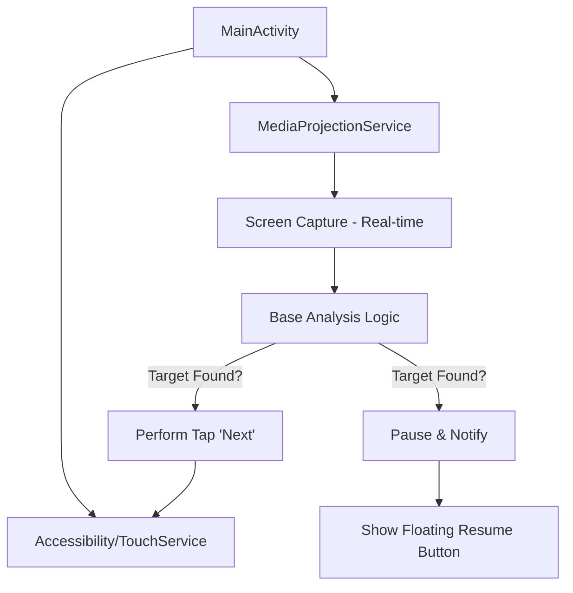

# ⚔️ CoC Attackbase Finder (Automation Engine)

An advanced Android automation tool designed for Clash of Clans enthusiasts. This application uses low-level system services to capture screen content in real-time and automate the "Next" action during base searching, allowing for hands-free discovery of profitable attack bases.

## 🏗️ Technical Architecture

The application relies on two critical Android background services to achieve high-performance automation without requiring root (for capture).

### The Automation Pipeline

```mermaid
graph TD
    UI[MainActivity] --> Proj[MediaProjectionService]
    UI --> Access[Accessibility/TouchService]
    
    Proj --> Capture[Screen Capture - Real-time]
    Capture --> Analysis[Base Analysis Logic]
    
    Analysis -- "Target Found?" --> NO[Perform Tap 'Next']
    NO --> Access
    
    Analysis -- "Target Found?" --> YES[Pause & Notify]
    YES --> Float[Show Floating Resume Button]
```

### Core Components
- **MediaProjection Engine**: High-frequency screen capturing using the `MediaProjection` API, running as a Foreground Service for stability.
- **Accessibility Auto-Touch**: Leverages `AccessibilityService` and `GestureDescription` to simulate human taps on the "Find Next" button coordinates.
- **Floating Overlay Control**: A `WindowManager`-based UI that provides a persistent "Pause/Resume" toggle even when the game is full-screen.
- **State Guard**: Intelligent cooldowns and state management to prevent infinite loops or accidental triggers in non-game screens.

## 🛠️ Tech Stack
- **Language**: Java
- **Core APIs**: `MediaProjection`, `AccessibilityService`, `LocalBroadcastManager`.
- **UI Architecture**: Foreground Service notifications and System Overlay windows.

## 🚀 Getting Started

### Permissions Required
1. **Screen Recording**: Prompted on start.
2. **Accessibility Service**: Must be manually enabled in Android Settings -> Accessibility.
3. **Display Over Other Apps**: Required for the floating control button.

### Usage
1. Launch the app and grant the necessary permissions.
2. Open Clash of Clans and enter the "Attack" screen.
3. Toggle the **Start Scan** button on the floating overlay.
4. The app will automatically "Next" until a base matching your criteria (or a timeout) is found.

---
> [!WARNING]
> Use of automation tools may violate the Terms of Service of certain games. Use at your own risk. This project is for educational purposes regarding Android Service orchestration.

**Sentinel Data Solutions** | *Game Automation Division*
**Developed by Zeca**
